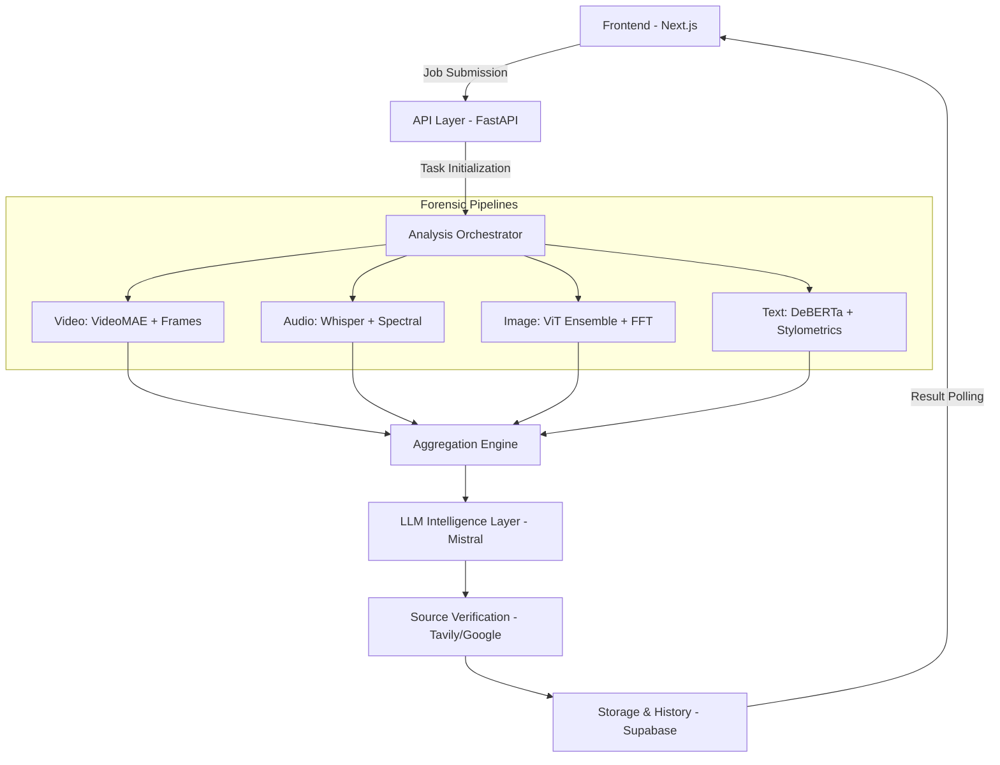

# ⚖️ Truth_X

### **Advanced AI-Powered Misinformation Intelligence & Forensic Analysis Platform**

[](https://www.python.org/)
[](https://nextjs.org/)
[](https://fastapi.tiangolo.com/)
[](https://pytorch.org/)
[](https://supabase.com/)

---
WORKING WEBSITE LINK : https://truth-x-a1wc.vercel.app/


## 🔍 1. Project Overview

**Truth_X** is a production-grade, multi-modal intelligence and forensic analysis platform engineered to combat the growing threat of digital deception. The system delivers an end-to-end verification pipeline capable of detecting **deepfakes**, **AI-generated content**, and **coordinated misinformation campaigns** across diverse media ecosystems.

Designed for journalists, OSINT investigators, cybersecurity teams, and forensic analysts, Truth_X goes beyond traditional classification systems by providing **source-grounded verification**, **advanced multimedia forensics**, and **scam intelligence analysis** within a unified investigative environment. By combining neural detection models with real-time evidence retrieval and cross-source validation, the platform produces transparent, defensible, and evidence-backed verdicts in an increasingly synthetic information landscape.


---

## ✨ 2. Feature Showcase

### 🧠 Source Check Intelligence
A state-of-the-art **RAG (Retrieval-Augmented Generation)** pipeline that surgically extracts factual claims from any medium and cross-references them against trusted global databases and live news cycles.

### 📝 AI Text Forensics
An advanced ensemble combining **DeBERTa-v3** neural detection with deep stylometric analysis. It measures perplexity, burstiness, and vocabulary entropy to distinguish human nuanced writing from LLM-generated content (GPT-4o, Claude 3.5, Gemini 1.5).

### 🖼️ Image Forensic Ensemble
Multi-stage analysis utilizing a primary vision transformer ensemble coupled with handcrafted local checks for **EXIF metadata anomalies**, resolution fingerprints, and **FFT-based frequency domain artifacts**.

### 🎬 Video Temporal Analysis
Leverages **VideoMAE** (Temporal Transformers) to detect frame-to-frame inconsistencies and temporal artifacts in facial manipulation that static image detectors frequently overlook.

### 🎙️ Audio Synthetic Detection & Scam Intelligence
Specialized spectral analysis for detecting cloned voices. Includes a **Live Audio Scam Detector** designed to identify conversational patterns and acoustic fingerprints common in AI-voice-cloned financial scams.

### 💬 Whisper Transcript Intelligence
Full integration with **OpenAI Whisper** for high-fidelity multi-lingual transcription, enabling semantic analysis and claim extraction even from low-quality or heavily compressed media streams.

### 🌐 OSINT Verification (Tavily & Google)
Direct integration with **Tavily Search** and **Google Fact Check API** to ingest real-time evidence, debunking articles, and institutional sources for immediate grounding.

### 🤖 Mistral Intelligence Summaries
A reasoning layer powered by **Mistral-Large-2411** that synthesizes raw neural signals into coherent, high-signal forensic reports with calibrated credibility scores.

### 📂 Multimedia Infrastructure
- **Local Media Support:** Direct upload and processing for Video, Audio, Image, and Document files.
- **History Logging:** Robust audit trail of all analysis jobs, stored securely in Supabase.
- **Explainability Engine:** Standardized "Forensic Indicator" reports for every analysis.
- **Real-Time Updates:** Socket-driven progress tracking for complex, multi-stage analysis jobs.

---

## 🏗️ 3. System Architecture

Truth_X is architected for asynchronous, high-throughput forensic processing.



### **Analysis Lifecycle**
1.  **Media Ingestion:** Files are validated, sanitized, and stored in a temporary processing buffer.
2.  **Transcript Flow:** If media has audio, Whisper generates a time-indexed transcript for semantic analysis.
3.  **Inference Pipelines:** Modality-specific neural detectors execute concurrently on GPU.
4.  **Verification Flow:** Claims are extracted from text/transcripts and queried against live OSINT sources.
5.  **Aggregation & Reasoning:** Results are fused, weighted, and interpreted by the LLM Intelligence Layer.

---

## 💻 4. Tech Stack

| Layer | Technologies |
| :--- | :--- |
| **Frontend** | Next.js 15, React 19, TailwindCSS, Framer Motion, Lucide |
| **Backend** | FastAPI, Python 3.11+, Uvicorn, Celery |
| **AI / Machine Learning** | PyTorch, Transformers, VideoMAE, Whisper, Sentence-Transformers |
| **Intelligence** | Mistral AI, Tavily API, Google Fact Check API |
| **Infrastructure** | Supabase (PostgreSQL), FAISS (Vector Store), Redis |
| **Forensics** | OpenCV, FFmpeg, Pillow, NumPy, SciPy (FFT) |
| **Ingestion** | yt-dlp, python-multipart |

---

## 📂 5. Project Structure

```bash
truth.x/
├── src/                    # Frontend: React/Next.js Application
│   ├── app/                # Next.js App Router (Layouts, Pages)
│   ├── components/         # Forensic UI (Dashboards, Results, Charts)
│   ├── context/            # Auth and UI Global State
│   └── services/           # API Integration logic
├── backend/                # Backend: FastAPI Forensic Engine
│   ├── api/                # REST Endpoints and Orchestration
│   ├── detectors/          # Neural Ensembles (Vision, Text, Audio)
│   ├── pipelines/          # Main Processing Logic & Aggregation
│   ├── rag/                # RAG: Claim extraction & Evidence matching
│   ├── services/           # Intelligence Clients (Mistral, Tavily)
│   ├── scoring/            # Credibility & Provenance Engines
│   └── utils/              # Media processing & Auth helpers
├── config/                 # YAML Configuration for Pipeline Weights
├── data/                   # Temporary Forensic Workspace (Transient)
└── supabase/               # SQL Migrations for History & Auth
```

---

## 🚀 6. Installation Guide

### **1. Clone the Repository**
```bash
git clone https://github.com/lakshay1184/truth-x-2.git
cd truth-x-2
```

### **2. Backend Environment (Python)**
**Windows:**
```powershell
python -m venv .venv
.\.venv\Scripts\activate
uv pip install -r requirements.txt
```
**Linux / macOS:**
```bash
python3 -m venv .venv
source .venv/bin/activate
pip install uv && uv pip install -r requirements.txt
```

### **3. Frontend Environment (Node.js)**
```bash
npm install
```

### **4. Start Services**
**Backend:**
```bash
python -m uvicorn backend.api.main:app --port 8000 --reload
```
**Frontend:**
```bash
npm run dev
```

---

## ⚙️ 7. Environment Variables

Truth_X requires several keys to enable full intelligence features. Create a `.env` in the project root and a `.env.local` for the frontend.

| Variable | Source | Required |
| :--- | :--- | :--- |
| `MISTRAL_API_KEY` | Mistral AI | Yes (Intelligence) |
| `TAVILY_API_KEY` | Tavily | Yes (Verification) |
| `NEXT_PUBLIC_SUPABASE_URL` | Supabase | Yes (History/Auth) |
| `NEXT_PUBLIC_SUPABASE_ANON_KEY` | Supabase | Yes (Frontend Auth) |
| `SUPABASE_SERVICE_ROLE_KEY` | Supabase | Yes (Backend Storage) |
| `HUGGING_FACE_HUB_TOKEN` | HuggingFace | Optional (Private Models) |

---

## ☁️ 8. Deployment Architecture

Truth_X is designed for a hybrid cloud deployment to balance cost and performance.

*   **Frontend:** [Vercel](https://vercel.com) (Edge-optimized for Next.js)
*   **Backend API:** [Render](https://render.com) or [Railway](https://railway.app) (Scalable FastAPI instances)
*   **GPU Workers:** [RunPod](https://runpod.io) or [Modal](https://modal.com) (On-demand serverless GPUs for VideoMAE/Whisper)
*   **Database & Auth:** [Supabase](https://supabase.com) (Managed Postgres + Auth)
*   **Vector Store:** [FAISS](https://github.com/facebookresearch/faiss) (Local or hosted on specialized vector pods)
*   **Storage:** Cloudinary or AWS S3 (Media persistence, if enabled)

---

## ⚙️ 9. Performance & Pipeline Design

*   **Async Orchestration:** Non-blocking job manager handles long-running video analysis while providing real-time status updates via polling/websockets.
*   **Graceful Degradation:** The pipeline is "Intelligence-Aware"—if an API fails, the system automatically falls back to local neural signals and heuristic weights.
*   **Evidence Reranking:** Evidence retrieved via Tavily is semantically reranked using Sentence-Transformers to ensure the highest quality grounding.
*   **Cleanup Lifecycle:** A strict temporary file manager purges processed media every 60 minutes to ensure workspace hygiene.

---

## 🛡️ 10. Security & Privacy

*   **Transient Storage:** All forensic processing happens in a non-persistent `data/processed` directory.
*   **No Retention:** Raw media is never stored permanently. Only metadata and analysis reports are persisted to the history log.
*   **Secure Ingestion:** Strict file-type validation and size limits (100MB default) protect against ingestion-based attacks.
*   **Encrypted History:** All analysis logs in Supabase are protected by Row Level Security (RLS) policies.

---

## 🗺️ 11. Roadmap

*   [ ] **Multilingual Intelligence:** Deep support for non-English misinformation analysis.
*   [ ] **Enterprise Monitoring:** Dashboard for tracking coordinated bot activity across social platforms.
*   [ ] **Browser Extension:** One-click forensic analysis for Twitter, YouTube, and Facebook.
*   [ ] **Advanced Deepfake Video:** Integration of face-landmark-aware 3D temporal models.
*   [ ] **Distributed Inference:** Support for multi-node GPU clustering.

---

